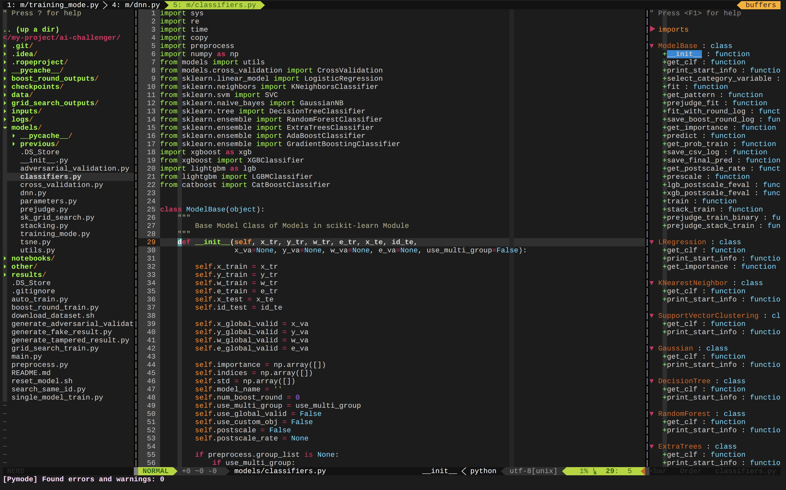
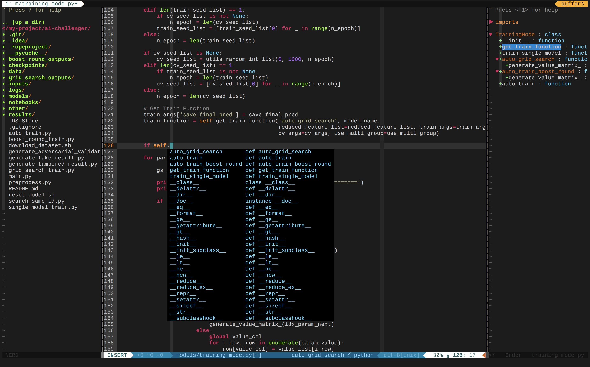

# My configuration for vim8.0.
***
## Features
***


***
## Plugin list:
***
* Tagbar
* taglist
* nerdtree
* ctrlp
* ag
* vim-airline
* vim-gitgutter
* winmanager
* undotree
* vim-colors-solarized
* molokai
* wombat256
* auto-pairs
* Indent-Guides
* nerdcommenter
* emmet-vim
* YouCompleteMe
* python-mode
* dash 
***
## Install vim8.0 and using my configuration
***
### 1. Install vim from source
* Clone from vim's official repository
```
git clone https://github.com/vim/vim.git
```
* Install dependent packages
```
sudo apt-get install libncurses5-dev libgnome2-dev libgnomeui-dev libgtk2.0-dev libatk1.0-dev libbonoboui2-dev libcairo2-dev libx11-dev libxpm-dev libxt-dev python-dev python3-dev ruby-dev lua5.1 lua5.1-dev git
```
* Install vim from source
You should confirm and replace the parameters of ```--with-python3-config-dir```(the path of  ```config-3.6m-x86_64-linux-gnu```) and ```--prefix```(the path of reposirepository that you want to install vim8.0).
```
cd vim/src
./configure --enable-perlinterp --enable-python3interp --enable-rubyinterp --enable-cscope --enable-gui=auto --enable-gtk2-check --with-features=huge --enable-multibyte --with-x --with-compiledby="asd" --with-python3-config-dir=/home/leander/anaconda3/lib/python3.6/config-3.6m-x86_64-linux-gnu/ --prefix=/opt/leander/vim80
make
sudo make install
```
* Clear files
```
cd ../../; rm -rf vim
```
***
### 2. Get my .bashrc
* Linux
```
git clone https://github.com/LeanderLXZ/vimrc.git
mv vimrc/linux/.vimrc ~/
rm -rf vimrc/
```
* MacOS
```
git clone https://github.com/LeanderLXZ/vimrc.git
mv vimrc/mac/.vimrc ~/
rm -rf vimrc/
```
***
### 3. Install plugins for vim
* Get Vundle - a very useful plugin manager for vim
```
git clone https://github.com/VundleVim/Vundle.vim.git ~/.vim/bundle/Vundle.vim
```
* Install plugins
Open vim in terminal
```
vim
```
install plugins using the command:
```
:VundleInstall
```
Wait until the install is completed.
***
### 4. Install dependencies of plugins
* Install powerline-fonts for vim-airline
```
git clone https://github.com/powerline/fonts.git --depth=1
cd fonts
./install.sh
cd ..
rm -rf fonts
```
* Install dependencies of YouCompleteMe
```
conda install libgcc
sudo apt-get install ruby ruby-dev libx11-dev libxt-dev libgtk2.0-dev libncurses5 ncurses-dev build-essential cmake python-dev python3-dev mercurial 
cd ~/.vim/bundle/YouCompleteMe
```
1)Install without C completer:
```
./install.py
```
2)Install with C completer:
```
./install.py --clang-completer
```
* Install CTags
```
wget http://prdownloads.sourceforge.net/ctags/ctags-5.8.tar.gz
tar -xzvf ctags-5.8.tar.gz
cd ctags-5.8/
./configure
make
sudo make install
cd ../ 
rm -rf ctags-5.8/
rm -rf ctags-5.8.tar.gz
sudo apt-get install silversearcher-ag
```
